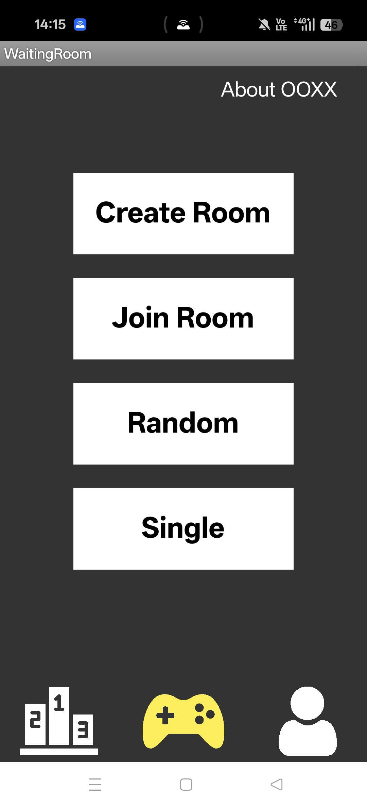

# Tic-Tac-Toe Android Project

Duration **2024-10 – 2024-12**

Android game built with App Inventor and Firebase.

## Web

You can check the latest version history and download the app here
[Tic-Tac-Toe](https://hsuan-yun.github.io/tictactoe-android-project)

## Images

  
  

  
  

## Features

*Android 11.0+ required*

- **User Settings**
  - Change username
  - Display registration and sign-in streak
  - Daily check-in
  - Display total games played, win rate, and loss rate
  - Add friends

- **Create Mode**
  - Create a private room and start a game

- **Join Mode**
  - Join a private room and start a game

- **Random Mode**
  - Create or join a public room

- **Single Mode**
  - Play offline (single-player mode)

- **Leaderboard**
  - View overall user leaderboard
  - View friends leaderboard

## Tech Stack

- App Inventor
- Firebase (Authentication & Firestore Database)